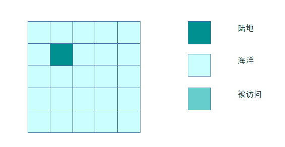
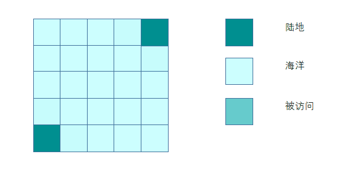
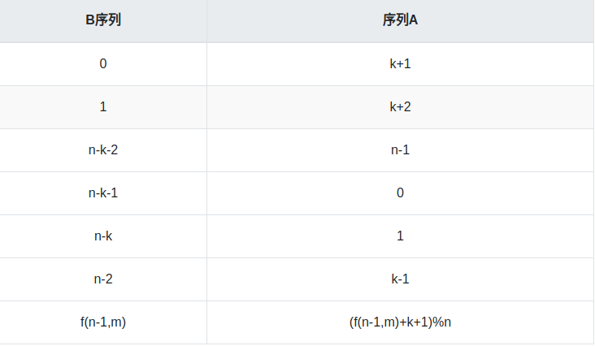

# Algorithm

## leetcode打卡记录
- [leetcode打卡记录](./leetcode-cn.md)


## 算法备忘录

### 快排
> 必须先j--, 再i++

> 最后 swap(arr[st], arr[i])

> i为partion一次的中枢轴

```c++
void quickSort(vector<int>& arr, int l, int r) {
    if (l >= r)
        return ;
    int val = arr[l];
    int i = l, j = r;
    while (i < j) {
        while (i < j && arr[j] >= val) j--;
        while (i < j && arr[i] <= val) i++;
        if (i < j) {
            swap(arr[i], arr[j]);
        }
    }
    swap(arr[l], arr[i]);
}
```

### 多源BFS
- 首先欣赏一组动图
#### 单源BFS


#### 多源BFS


### 树状数组 BIT ( Binary index tree )
`BIT` 也叫 `树状数组`

首先看如下数学式
```
e[1] = a[1] 
e[2] = a[1]+a[2]
e[3] = a[3]
e[4] = a[1]+a[2]+a[3]+a[4]
e[5] = a[5]
e[6] = a[5]+a[6]
e[7] = a[7]
e[8] = a[1]+a[2]+...+a[8] 

数组下标i表示为二进制，i从末尾开始连续0的个数定义为k。
e[i]=a[i-2^k +1]+a[i-2^k+2]+...+a[i]。
e[8(1000)] = a[1]+a[2]+...+a[8]
```
- 从上面可以知道 数组`a[0]`是废弃的, 起点从`a[1]`开始
- 至于**区间更新,区间查询**, **区间更新,单点查询**之类的 看一下参考链接吧


#### 代码
```c++
int bit(int x) {
    return (x) & (-x);
}

vector<int>& BIT;

// 求[1...pos]的和
int getSum(vector<int>& BIT,int pos) {
    int sum = 0;
    while (pos > 0) {
        sum += BIT[pos];
        pos -= bit(x);
    }
    return sum;
}

// 给对应pos位 +x
void updateBit(vector<int>& BIT, int pos, int x) {
    int n = BIT.size();
    while (pos < n) {
        BIT[pos] += x;
        pos += bit(pos);
    }
}
```

####  参考链接
- [树状数组详解](https://www.cnblogs.com/xenny/p/9739600.html)

### 约瑟夫环
#### 题目
0,1,...,n-1这n个数字排成一个圆圈，从数字0开始，每次从这个圆圈里删除第m个数字。求出这个圆圈里剩下的最后一个数字。

#### 解析

一步到位就不搞模拟了

- `f(n,m)`代表在`连续n个数(从0到n-1)`里面删除`第m个`数组的被删除的那个数
- 显然第一个删除的数为 `(m-1)%n`, 我们假定这个数为k
- 删除第一个数后剩余的数为`0 1 ... k-1 k+1 k+2 ... n-1`
- 由于下一轮从`k-1`开始, 因此有如下映射关系



- 由于 `k = (m-1) % n`
- 我们可以看出来`f(n-1, m) = (f(n-1,m) + k+1) %n = (f(n-1)+m) % n`

因此有了递推式

```c++
f(1, m) = 0  // 只剩一个数的时候, 删除的第m个数肯定是0
f(n, m) = (f(n-1)+m) % n
```

### kmp
# kmp

next数组表示 **前缀与后缀的最长匹配长度-1**

具体有什么意义呢？

接下来会来解释

比如 s串`abcabcabd`

```
a  b  c  a  b  c  a  b  d
-1 -1 -1 0  1  2  3  4 -1
```
你会发现 `如果next[i]不等于-1, s[i] == s[next[i]]`

这样做的意义是什么呢，是为了**快速回退**(减少不必要的字符匹配)


## 举例
```
s串
ississip
t串
issip
```
先分析出`t串`的`next`数组
```
i  s  s  i  p
-1 -1 -1 0  -1
```

然后去匹配,会发现如下情况不匹配了
```
i s s i s s i p 
i s s i p
```

由于我前一位`i`的`next[i]`为`0`，那么接下来将做如下匹配, 注意由上面的code到下面的code仅仅需要一步
```
i s s i s s i p
      i s s i p
```


## code
```c++
class Solution {
public:
    int strStr(string s, string t) {
        if (t == "") return 0;
        int l1 = s.size(), l2 = t.size();

        int next[l2] = {0};
        next[0] = -1;
        for (int i=1; i<l2; i++) {
            int k = next[i-1];
            while (k != -1 && t[k+1] != t[i])  k = next[k];
            if (t[i] == t[k+1]) {
                next[i] = k+1;
            } else {
                next[i] = -1;
            }
        }
        
        int i = 0, j = 0;
        while (i < l1) {
            if (s[i] == t[j]) {
                i++,j++;
                if (j == l2) {
                    return i - l2;
                }
            } else {
                if (j == 0) {
                    i++;
                } else {
                    j = next[j-1] + 1;
                }
            }
        }
        return -1;
    }
};
```
### 优先队列比较函数
语法如下
> 需要注意的一点是  比较函数里面写的是 a < b, 实际返回结果`que.top()`是最大值 对立的..
```cpp
auto cmp = [](int a,int b) {
    return a < b;
};
priority<int, vector<int>, decltype(cmp)> que(cmp);
```

### 单调栈专题
|  number   | title | 
|  :----:  | :----:  |
| 84 | 柱状图中最大的矩形 |
| 239| 滑动窗口最大值 |
| 739| 每日温度 |
| 862|  **和至少为 K 的最短子数组** |
| 901| 股票价格跨度 |
| 907| 子数组的最小值之和 |