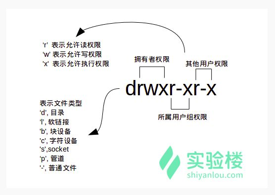

# linux基础
## 快捷键


- `ctrl + a` 是`home`的快捷键
- `ctrl + e` 是`end`的快捷键

### 后台任务切回
- `ctrl + z`是将任务放到后台去运行
- 命令 `fg` 或者 `fg [%number]` 可以恢复在后台执行的程序（栈类似的

### 切换不同的终端
使用如下快捷键
```
ctrl + alt + [F1 - F7]
```
注意到 在ubuntu18.04 `ctrl + alt + F2`为图形界面 其余为`terminal`

### 向前删除一个单词 
`alt + backspace`

### 批量创建文件
`touch {1..10}.txt`


## 用户,组相关 
### 用户创建
`sudo adduser ${user}`

#### adduser 和 useradd 的区别是什么
useradd 只创建用户，不会创建用户密码和工作目录，创建完了需要使用 passwd <username> 去设置新用户的密码。adduser 在创建用户的同时，会创建工作目录和密码（提示你设置），做这一系列的操作。其实 `useradd`、`userdel` 这类操作更像是一种命令，执行完了就返回。而 `adduser` 更像是一种程序，需要你输入、确定等一系列操作。

### 更改密码
`sudo passwd ${user}`

### 删除用户
`sudo deluser ${user} --remove-home`

### 删除用户组 
`groupdel`
### 用户改变权限
`sudo usermod -G sudo ${user}` 给user添加`sudo`权限


## 文件

### 文件类型及权限


### 查看文件最后几行
`tail -n ${lineNum} ${file}`

### 查看文件开头几行
`head -n ${lineNum} ${file}`


## vim教程
`vimtutor`命令

### 方向
```
      ^
      k
< h       l >
      j
      v
```

### 删除
- `x` 删除单个字符
- `dd` 删除单行
- `dw` 删除一个单词
- `d$` 删除从当前光标到行尾
- `d^` 删除从当前光标到行首

### 数字操作
- `0` 移动到行首
- `w` 移动到单词首部
- `e` 移动到单词尾部

### 撤销操作
- `u` 撤销之前的操作
- `U` 撤销整行
- `ctrl + r` 撤销回撤销操作 (二次反悔)

### 粘贴操作
- `p` 表示粘贴, 当前光标在`i`行，按`p`会把内容粘贴到`i+1`行

### 替换操作
- `r` 表示替换一个字符
- `cw` 表示替换一个单词
- `:#,#s/old/new/g` 对old替换为new,(#中间为行号)

### 定位
- `ctrl + g` 当前文件定位

### 搜索
- `/ + 要搜索的字符串` (`n`为下一个，`shift + n`为上一个)

### 括号匹配
- `%` 当在`(`按`%`, 会跳转到匹配的`)`


### 跳转
- `gg` 跳转到首部
- `shift + g` 跳转尾部
- `数字 + shift + g` 跳转到指定行

### 外部执行命令
`:! + 命令`
`:r + 文件` 导入文件到当前光标下
### 比较差异
`vimdiff a.txt b.txt`

## 环境变量
- `set` 显示当前Shell所有变量
- `env` 显示与当前用户相关的环境变量
- `export` 显示从shell中导出环境变量的变量
- 写在 **`/etc/profile`**里面的是对所有用户永久生效
- `unset` 删除一个环境变量

## 搜索文件
- `locate /usr/share/\*.jpg`. 这里的`*`前面的反斜杠表示转义
- `sudo find /etc/ -name interfaces`   
- **`sudo find /etc/ -name "*.list"`** 找出 /etc/ 目录下的所有以 .list 结尾的文件, 这里的`.list`必须被引号包住


## 压缩 & 解压

### zip
```shell
# 压缩
zip -r -o ${file.zip} ${to_be_ziped}
# 解压
unzip ${file.zip} -d ${to_be_unzip_direction}
```

### tar
```shell
# 压缩
tar -cvf ${file.tar} ${to_be_tared}  # -c 是create -v 是visiual -f 是file
# 解压
tar -xvf ${to_be_untared} -C ${to_be_untar_direction} # -x 是提取 -C 输出到指定目录
```

## 磁盘管理
### df

`df -h`对磁盘空间进行分析

### du
对当前目录空间进行分析
`du -sh *` `-s`是`summary`的意思

## 进程管理

### 基础知识
- `ppid`父进程id, `pid`当前进程id, `pgid`当前进程组id
### ps查看进程
- `ps －fxo user,ppid,pid,pgid,command` 格式化