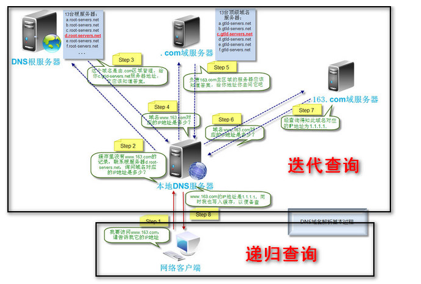
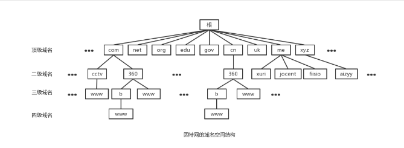
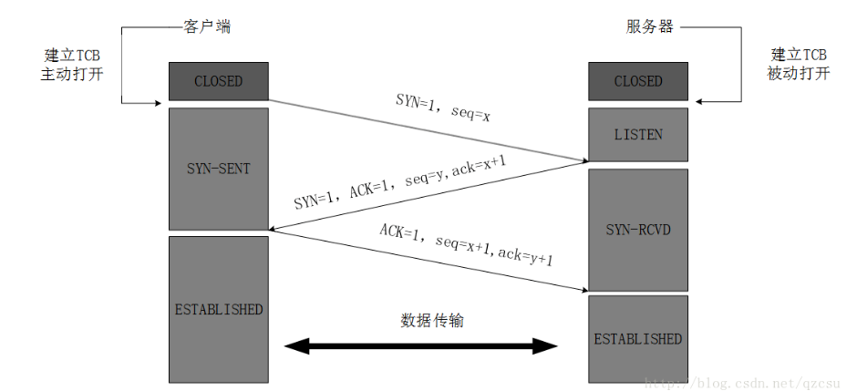
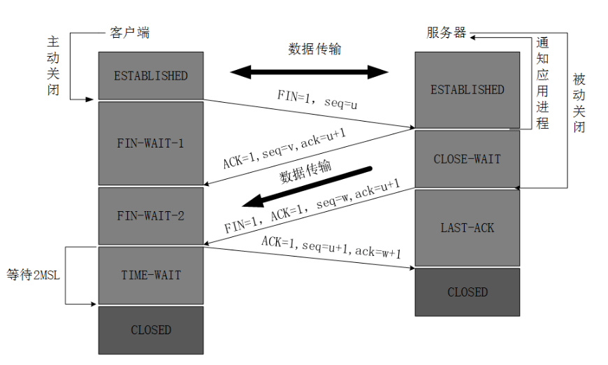
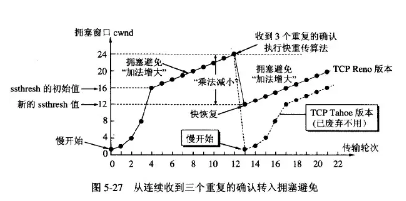
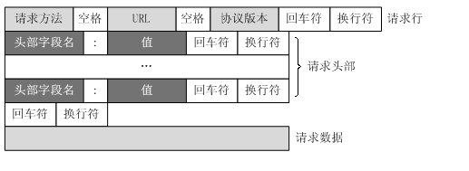
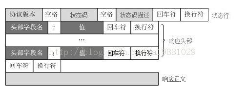

## 输入url发生了什么
URL输入(HTTP协议) -> DNS解析(域名转为IP) -> TCP链接 -> 发送HTTP请求 -> 服务端处理请求 -> 服务端响应请求 -> 浏览器解析渲染页面 -> 连接结束

> protocol://hostname[:port]/path/[;paramters][?query]#fragment

DNS解析 浏览器缓存->操作系统缓存->本地host文件->路由器缓存->ISP DNS缓存 -> 顶级DNS服务器/根DNS服务器

本地请求本地DNS服务器是 递归查询
本地DNS服务器请求DNS 是 迭代查询

[DNS请求具体](http://www.xumenger.com/dns-udp-tcp-20180604/)

> DNS通常是基于UDP的，但当数据长度大于512字节的时候，为了保证传输质量，就会使用基于TCP的实现方式

## 协议栈
物理层 链路层 网络层 传输层 会话层 表现层 应用层

## TCP

### 基本特点
1. 面向连接
2. 点对点
3. 全双工
4. 基于字节流(UDP是整个报文)
5. 可靠交付

TCP需要解决的有面向连接(建立连接 关闭连接)，**可靠传输**（错误确认和重传），**流量控制**（发送方和接收方的传输速率协调），**拥塞控制**
### TCP标志位

- ack 
- fin
- psh (push 缓冲区未满 对面着急要)
- urg (urgency 紧急中断，如停止下载之类的)
- syn
- rst (reset 由于丢包，重新建立连接)

### TCP报文

序号/确认号 解决 丢失，重复，乱序的问题
### 三次握手

1. 序号存在的目的是为了能否区分多个 TCP 连接，毕竟是一个服务器，多个客户端，不然各个 TCP 连接就会变得非常混乱。
2. 比两次握手好的地方就是 提升资源利用把
3. SYN 洪泛攻击就是让客户端乱遭一些 IP 然后和服务器建立TCP 连接，由于服务器收不到 ACK 但是他分配了变量，导致一直在消耗服务器资源。这个解决方法就是采用 SYNCookie 这个 Cookie 其实就是服务器在发送 SYNACK 的头部的 seq 序号的值，那么客户端必须返回一个比 Cookie 大一的 ACK 回来才是正确的，否则不分配变量，也就是变量延时分配。 **存一个map,然后，>之前的seq我才入队**。

### 可靠传输

TCP 主要是`确认重传机制` `数据校验` `数据合理分片和排序` `流量控制` `拥塞控制`

### 流量与拥塞

1. 流量就是 发送窗口 <= 接受窗口 防止缓冲区溢出

2. 拥塞的话就看下面的图把

   

### 杂乱知识点儿

- 挥手的 FIN-WAIT-2 

- 四次挥手后的等待，MSL 时间 一个MSL是建议2分钟 所以2MSL是4分钟

  为什么要设置TIME-WAIT呢，因为为了全双工的信道能够正确的被释放，提升资源利用，并且在time-wait 和 last-ack阶段，收到的其他非ack报文请求 均无效

- time-wait 的快速回收，fin-wait-2 的设定时间 - vim /etc/sysctl.conf net.ipv4.tcp_fin_timeout

- close-wait 大量出现 就是程序员遇到连接异常后，没有及时关闭，我们可以加一个超时的机制

- last-ack 如果收不到ack怎么半

  会重发FIN，这时候分两种情况 
  (1)主动断开的一方还在TIME_WAIT状态中。这时候会发过来ACK， 被断开的一方收到后顺利从LAST_ACK进入到CLOSED。 
  (2)主动断开的一方经过了2msl已经CLOSED了这时候会返回**RST**。被断开的一方收到后也会进入CLOSED状态。总之LAST_ACK总会进入到CLOSED状态不需要超时机制。

TCP 连接能否感知对方是否在线（规范不能，实际可以），TCP 保活机制（SO_KEEPALIVE），保活参数（保活定时，失活前检查参数等），应用层面保活（心跳包，ping/pong 包等））；

https://www.jianshu.com/p/31222c1fbe56

保活 是服务器用来确认什么时候应该断开连接的一种机制

UDP（可能作为对比来问，无连接，尽力而为，面向报文，无各种控制，一对一，一对多，多对多，首部大小及结构，校验和计算过程（求和，溢出回卷，反码，校验等），可能间插着问问正反补码）；
TCP，UDP 伪首部，虚拟的数据结构，参与计算校验和，简单了解；

## HTTP
HTTP的话

### 请求报文

### 响应报文

HTTP（基本描述，Method，协议版本及新版本特点，请求响应报文结构，常用请求头字段，常见响应状态码（每类记几个），RFC规范（知道这个词儿是啥就行了）等）；

单拎出来的缓存问题，结合状态码 304 可能问到，相关头字段，If-Modified-Since 和 Last-Modified，If-None-Match 和 ETag，它们的区别等；

单拎出来的 cookie 和 session 问题，搞清楚它们是干啥的，相关的头字段，其中 session 可能扩展到分布式上；
单拎出来的跨域问题，了解下浏览器同源（协议，域名，端口）政策，对后端的限制（AJAX等，前端问题暂不考虑），解决方法（JSONP，WebSocket，CORS），CORS（Cross-Origin Resource Sharing）相关内容，头字段 Origin，Access-Control-Allow-Origin 等；

**HTTPS（基本描述，主要作用，和 HTTP 的区别，SSL/TLS 握手过程，为什么过程要这样设计，对称/非对称加密，公私钥，证书，签名，CA，浏览器校验，加密算法（这个我并不懂）等）**

SOCKS（了解下这是干啥的，以及基本流程）；
传输层（端到端通信服务，多路分解与多路复用，端口号的作用，套接字）；

网络层（主机到主机间的逻辑通信）；
IP （感觉其实传输层以下问的不多，能说出来就行了。v4/v6，点分十进制，各类地址空间，DNS，NAT，DHCP，路由寻址，EGP（BGP 看一下留个印象），IGP（RIP，OSPF 留个印象））；
ICMP（知道类型 0 和类型 8 报文是啥（Echo 响应与请求），ping 的流程）；
ARP（地址解析协议，了解一下流程什么的）；
MAC（介质访问控制协议，简单了解一下）；

