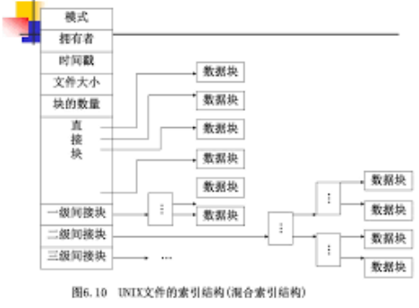

## 操作系统

### 处理器调度
- 进程和线程的区别，线程的好处(一个文件系统的进程，可能因为某些原因阻塞了，但是如果是线程的话，可以继续用别的线程提供服务，提升整体系统的吞吐量)

- 进程间通信的方式(7种， 匿名管道，具名管道，消息队列，信号量，信号，共享内存，socket)

- 进程的状态 (1. 新建 2. 就绪(除了CPU，别的资源已经准备好了) 3. 运行 4. 阻塞(申请资源未申请到，IO等待) 5. 结束)

- 处理器管理 (调度 1. 先来先服务 2. 短作业优先 3. 最短剩余时间优先 4. 高响应比 响应比的定义(1 + 已经等待的/估计运行时间) 5. 优先权 6. 时间片轮转)

- 死锁的四个必要条件 (1. 资源互斥 2. 占有并等待 3. 不剥夺 4. 环路等待)

- 银行家算法 尽可能先满足资源需求大的进程(这样，这个进程释放的时候，就会释放更多的资源，供后面的进程资源调度)

- 多进程(multiprocess) 写过多进程的归并，多进程相比多线程就是数据拷贝多一些，但是python上能利用多核的性能优势

- **goroutine**的调度原理 **G - P - M** goruntine - processor - manger

  https://tonybai.com/2017/06/23/an-intro-about-goroutine-scheduler/

### 内存管理
- 逻辑地址， 物理地址， 实际地址的关系

    逻辑地址就是程序生成二进制的code后，实际存放的位置，物理地址就是程序运行后实际存放的位置，中间是有一个逻辑物理的映射
    
    实际地址同物理地址

- 页式存储管理/ 段式存储管理

    页表中存放的是叶号和块号
    叶号对应相应的物理块号
    同理 段表中存放的是段号和块号

    段是信息的逻辑单位，由源程序的逻辑结构所决定，段长根据用户需要来规定
    页是信息的物理单位，页长由系统确定

    现在通用的存储结构是 段页式存储管理
    程序根据自身的逻辑结构划分为若干段，内存物理地址空间划分成若干相等的物理块(页)
- 虚拟存储

    逻辑地址 -> 内存 -> 磁盘
- 内存管理 (1. FIFO 2. LRU 3. LFU )

### 文件管理
- 系统打开文件，就要把FAT表加载到内存。 当打开一个文件，只需要把该文件占用的盘块的编号调入内存即可。为此，应将每个文件锁对应的盘块号集中存放到一起，访问到这个文件再将它对应的盘块号信息一起调入内存。**系统为每个文件建立一个索引表，集中记录该文件占用的盘块号。** 索引表存放再文件控制块(FCB)中,但是大文件的索引表很大，所以大多数文件系统让索引表置于单独的物理块中且驻留在磁盘的任意位置，FCB的文件地址只保留索引表所在的盘块号(即索引表的位置)

所以一个文件想要打开  先加载FCB -> 查找对应的索引表的位置，加载到内存 -> 查找索引表所对应的物理块的位置，加载文件

所以加载一个文件要经过两次读取磁盘.

- 硬链接(同样的文件指针，但是不能跨文件系统)，软连接(存文件路径)
- 文件系统 FAT(File Allowcation Table)
- NTFS(里面最重要的是有一个MFT Master File Table) MasterFileTable就相当于文件meta信息管理，但是如果文件小的话，也会将文件内容放到MasterFileTable里面，减少磁盘IO次数