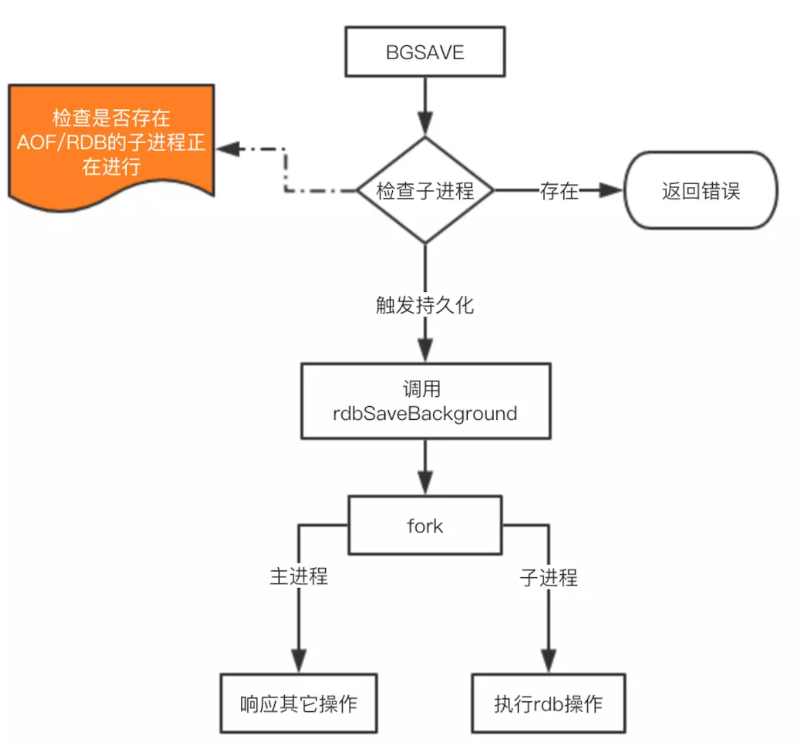
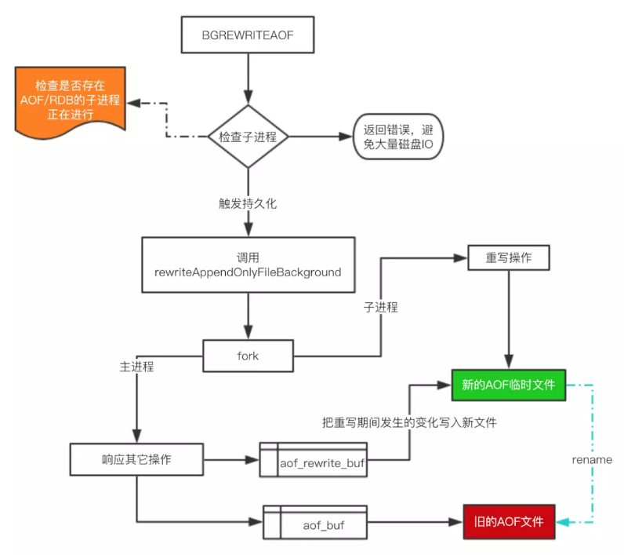
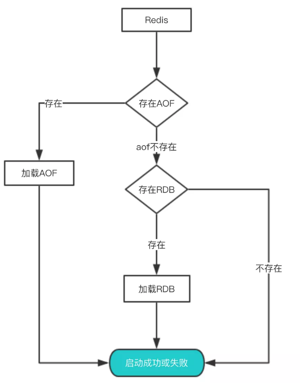

## Redis 持久化
  因为Redis是内存数据库，它将自己的数据库状态储存在内存里面，所以如果不想办法将储存在内存中的数据库状态保存到磁盘里面，那么一旦服务器进程退出，服务器中的数据库状态也会消失不见
## 流程图
RDB流程

AOF流程

redis Restart


### RDB 配置
```shell
# 时间策略
save 900 1
save 300 10
save 60 10000

# 文件名称
dbfilename dump.rdb

# 文件保存路径
dir /home/work/app/redis/data/

# 如果持久化出错，主进程是否停止写入
stop-writes-on-bgsave-error yes

# 是否压缩
rdbcompression yes

# 导入时是否检查
rdbchecksum yes
```

### AOF 配置
```shell
# 是否开启aof
appendonly yes

# 文件名称
appendfilename "appendonly.aof"

# 同步方式
appendfsync everysec

# aof重写期间是否同步
no-appendfsync-on-rewrite no

# 重写触发配置
auto-aof-rewrite-percentage 100
auto-aof-rewrite-min-size 64mb

# 如果为yes，加载aof时发现aof尾部不正确是，会向客户端写入一个log，但是会继续执行，如果设置为 no ，发现错误就会停止，必须修复后才能重新加载
aof-load-truncated yes

# 文件重写策略
aof-rewrite-incremental-fsync yes
```